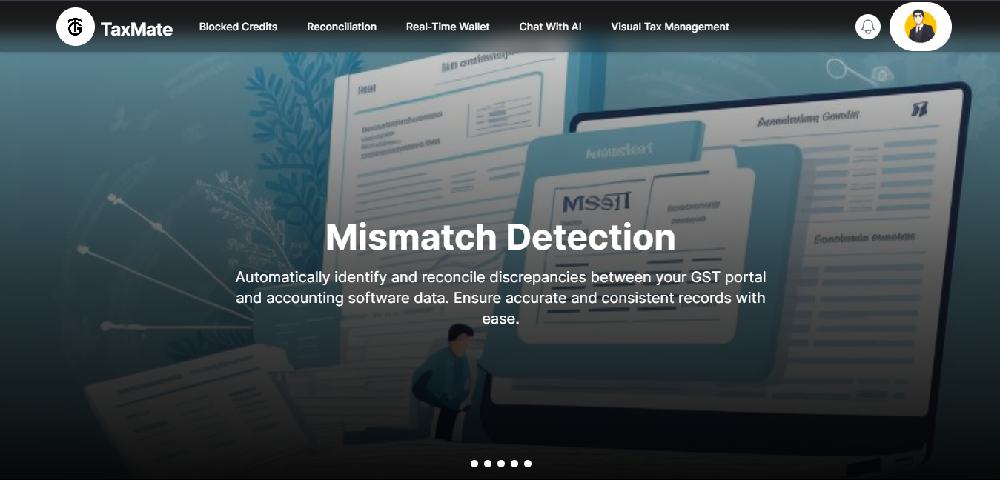
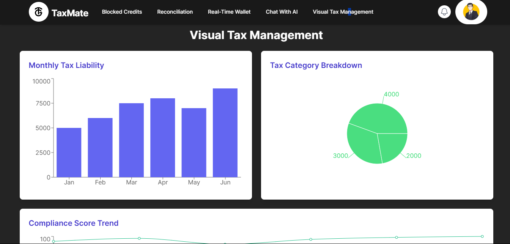

# TaxMate - GST Reconciliation Platform  

TaxMate is an innovative web platform designed to simplify GST reconciliation and streamline financial processes. Built with the **MERN stack**, TaxMate integrates powerful features such as **.xlsx file handling**, **AI-driven chatbots**, and **real-time error resolution**, making it the perfect tool for businesses seeking efficient tax management.  

## Features  
- **GST Reconciliation**: Compare transactions between GST portals and accounting software to identify mismatches effortlessly.  
- **Blocked Credit Identification**: Automatically identify and categorize blocked credits to ensure compliance.  
- **Real-Time Error Resolution**: Resolve transaction errors instantly using the integrated wallet functionality.  
- **Excel File (.xlsx) Support**: Upload and process Excel files for seamless transaction analysis and reconciliation.  
- **AI Chatbot**: Leverage an AI-powered chatbot for user support and query resolution, integrated using the **Gemini API**.  
- **Data Visualization**: Gain actionable insights with intuitive graphs and charts for transaction summaries and analytics.  

## Technologies Used  
- **Frontend**: React, Tailwind CSS  
- **Backend**: Node.js, Express  
- **Database**: MongoDB  
- **APIs and Integrations**:  
  - Gemini API for chatbot functionality  
  - Third-party libraries for Excel file parsing and operations  
  - Data visualization libraries for graphical insights  

## Installation and Setup  
Follow these steps to set up and run TaxMate on your local system:  

### Prerequisites  
Ensure you have the following installed on your system:  
- Node.js  
- MongoDB  

### Steps  
1. Clone the repository:  
   ```bash  
   git clone https://github.com/YourUsername/TaxMate.git  
   ```  

2. Navigate to the project directory:  
   ```bash  
   cd TaxMate  
   ```  

3. Install dependencies for the backend:  
   ```bash  
   cd backend  
   npm install  
   ```  

4. Install dependencies for the frontend:  
   ```bash  
   cd ../frontend  
   npm install  
   ```  

5. Start the MongoDB server locally or connect to your cloud MongoDB instance.  

6. Configure environment variables:  
   Create a `.env` file in the `backend` folder and add the following:  
   ```env  
   PORT=5000  
   MONGO_URI=your_mongo_database_connection_string  
   GEMINI_API_KEY=your_gemini_api_key  
   ```  

7. Start the backend server:  
   ```bash  
   cd backend  
   npm start  
   ```  

8. Start the frontend:  
   ```bash  
   cd ../frontend  
   npm start  
   ```  

9. Access the application at `http://localhost:3000`.  

## Usage  
- Upload Excel files for transaction reconciliation and analysis.  
- Use the AI chatbot for quick assistance and FAQs.  
- Visualize GST summaries and insights through the intuitive dashboard.  

📸 Screenshots
Take a look at how TaxMate appears in action:

<table width="100%"> <tr> <td align="center"> <strong>🏠 Homepage</strong><br>  </td> <td align="center"> <strong>📊 Graph Insights</strong><br>  </td> </tr> <tr> <td align="center"> <strong>💸 Real-Time Wallet</strong><br>  </td> <td align="center"> <strong>🚫 Blocked Credits</strong><br>  </td> </tr> </table>
These visuals highlight the TaxMate experience — from real-time tax wallet tracking to visual analytics and handling blocked credits.

## Future Enhancements  
- Multi-language support for a broader user base.  
- Advanced AI analytics to provide predictive insights.  
- Integration with other accounting software like Tally and QuickBooks.  

## Contributing  
We welcome contributions from the community. To contribute:  
1. Fork the repository.  
2. Create a new branch: `git checkout -b feature/YourFeatureName`.  
3. Commit your changes: `git commit -m 'Add some feature'`.  
4. Push to the branch: `git push origin feature/YourFeatureName`.  
5. Open a pull request.  
